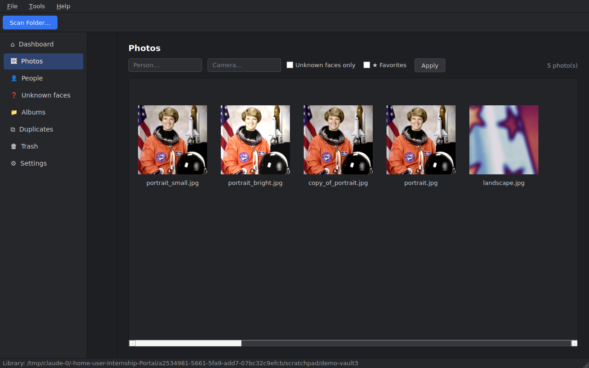
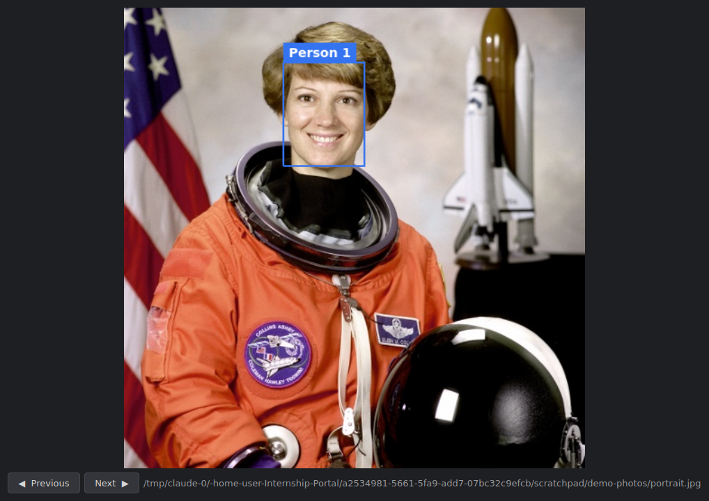

# FaceVault

Offline photo library manager with **local face recognition** — sort and
group your photos by the people in them, entirely on your own machine.

- **100% offline.** The AI models (YuNet detection + SFace embeddings,
  ~37 MB total, committed in `models/`) run on CPU via OpenCV. No cloud
  APIs, no accounts, no telemetry, zero network calls at runtime.
- **Desktop app** (PySide6, dark Lightroom-style UI) **and CLI** with full
  feature parity.
- Faces are detected, aligned, embedded and clustered into people you can
  rename, merge and export. Exact and near-duplicates are found
  automatically. Everything is searchable by person, camera, date, GPS and
  quality.

The desktop app has eight sections: **Dashboard** (library stats,
"Memories — on this day", scan history), **Photos** (timeline grouped by
month, filter by person/camera/favorites/unknown, viewer with face
overlays and slideshow), **People** (auto-grouped person grid — rename,
merge, export, browse), **Unknown faces** (assign leftover faces to
people manually or create new people), **Albums**, **Duplicates**
(exact + near), **Trash** (restore or delete permanently), and
**Settings**.

**Save photos into folders by face (Google-Photos style):**
`File → Export people to folders…` copies your library into
`Destination/<Person name>/` — one folder per person, photos with several
people copied into each of their folders, optionally an `Unknown faces/`
folder. From the CLI:

```bash
python -m app export-people ~/Desktop/ByPerson --include-unknown
```

**Semantic AI search:** type a description — `"sunset at the beach"`,
`"person smiling"`, `"red car"` — into the AI search bar in Photos (or
`python -m app search --describe "..."`). Runs a local CLIP model
(quantized ViT-B/32 via ONNX Runtime), fully offline. Photos are indexed
during scanning; for a library scanned before installing the models run
`python -m app semantic-index` once.

**Photo editor:** ✎ Edit in the viewer — rotate, flip, drag-to-crop,
brightness/contrast/saturation, one-click auto-enhance. Saves as a copy
next to the original (never overwrites) and the copy is indexed into the
library immediately.

Other Google-Photos-style features: favorites (★ in the viewer or
right-click, filter in Photos), trash with restore, month-grouped
timeline, "On this day" memories on the dashboard, slideshow in the
viewer, and `Tools → Rescan all scanned folders` (or `python -m app
rescan`) to pick up new photos in one click. Backup/sync and sharing are
deliberately absent — they require a server, and FaceVault is 100%
offline.

## Look-alike people getting merged?

Three tools, in order of impact:

1. **Upgrade the recognition model to ArcFace** (512-d embeddings, far
   better at separating similar faces than the built-in SFace 128-d):
   ```bash
   python models/download_models.py --arcface   # one-time, ~166 MB
   python -m app scan ~/Pictures --full         # re-embed every face
   ```
   FaceVault switches to ArcFace automatically once the file exists
   (Settings shows which model is active).
2. **Look-alike margin** (Settings): a face is auto-assigned only when
   its best person match clearly beats the runner-up. Raise it (e.g.
   0.06 → 0.10) and ambiguous faces land in *Unknown faces* for you to
   assign manually instead of being guessed.
3. **Split person** — right-click a wrongly merged person → *Split
   person* (or `python -m app split ID`): their faces are re-clustered
   strictly; distinct sub-groups become separate people, uncertain
   faces go to Unknown.

Also raising the *Face match threshold* (0.40 → 0.45) makes all
grouping stricter across the board.

## GPU acceleration

By default the ONNX models (ArcFace, CLIP semantic search, OCR) run on
CPU. To run them on your GPU, replace the runtime — FaceVault then picks
the best provider automatically (CUDA → DirectML → CPU):

```bash
# Windows, ANY GPU (easiest — no CUDA install needed):
pip uninstall onnxruntime && pip install onnxruntime-directml

# NVIDIA CUDA (Windows/Linux, needs a current NVIDIA driver):
pip uninstall onnxruntime && pip install onnxruntime-gpu
```

Verify what's active at any time:

```bash
python -m app gpu
```

(The Settings page also shows the active AI compute provider.) YuNet
face *detection* and SFace run via OpenCV, which is CPU-only in pip
builds — they're lightweight; the heavy models are the ones that move
to GPU.

## Search by what's in the photo (object tags)

Every photo is auto-tagged with the objects it contains (dog, car,
laptop, bottle, … — 80 COCO categories) using a local YOLOv8 model
(bundled in `models/`, runs on ONNX Runtime, GPU-accelerated). Search
with the "Object…" box in Photos or:

```bash
python -m app search --tag dog
```

Toggle in Settings ("Auto-tag objects during scans"). Existing photos
get tags on the next `scan --full`.

## Local REST API

Other apps (or a future web UI) can query the same library over HTTP:

```bash
python -m app serve      # http://127.0.0.1:8090  — interactive docs at /docs
```

```bash
curl -X POST http://127.0.0.1:8090/api/search \
     -H "Content-Type: application/json" \
     -d '{"query": "dog near river"}'          # semantic
curl -X POST http://127.0.0.1:8090/api/search -d '{"tag": "car"}'
curl -X POST http://127.0.0.1:8090/api/search -d '{"person": "Ram", "favorites": true}'
```

Endpoints: `POST /api/search` (semantic via `query`, or filters
`person`/`camera`/`text`/`tag`/`favorites`), `GET /api/people`,
`GET /api/stats`, `GET /api/photos/{id}/thumbnail`,
`GET /api/photos/{id}/file`. Needs `pip install fastapi uvicorn`.
Binds localhost only, no auth — don't expose it to a network as-is.

## OCR — find photos by the text in them

Documents, receipts, screenshots and certificates become searchable:
the "Text in photo…" filter in Photos, or

```bash
python -m app search --text invoice
```

Text is extracted during scans when `rapidocr-onnxruntime` is installed
(in requirements.txt; models ship inside the package — still offline).
Toggle it in Settings ("Extract text during scans") — OCR is the slowest
pipeline step, so switch it off for speed if you don't need it. Photos
scanned before enabling OCR get their text on the next `scan --full`.

## Stopping a scan

Click **⏹ Stop** next to the progress bar (or Ctrl+C in the CLI).
Photos processed so far are saved, the scan is marked *cancelled* in
history, and re-running the scan later continues incrementally from
where it stopped.




## Quick start

```bash
cd FaceVault
python -m venv .venv && source .venv/bin/activate   # Windows: .venv\Scripts\activate
pip install -r requirements.txt

# CLI
python -m app scan ~/Pictures        # detect faces, group people, find duplicates
python -m app people                 # list discovered people
python -m app rename 1 "Ram"         # name person 1
python -m app person 1               # all photos of Ram
python -m app merge 4 1              # person 4 was also Ram — merge
python -m app duplicates --near      # exact + near duplicate report
python -m app similar selfie.jpg     # who is this? search the library
python -m app search --person Ram --camera Sony --after 2025-01-01
python -m app export-person 1 ~/Desktop/Ram
python -m app stats

# Desktop app
python -m app gui
```

Re-scans are incremental — unchanged files are skipped, new photos are
matched against the people you already named.

Detection runs in **accurate** mode by default (multi-pass: high
resolution + contrast-enhanced + mirrored, merged — better on small,
dark and profile faces). For very large libraries use
`python -m app scan ~/Pictures --mode fast` (~3× quicker), or change the
default under Settings in the GUI.

Your library (database + thumbnails) lives in `~/.facevault` (override
with `--data-dir` or `FACEVAULT_DATA_DIR`). Original photos are never
moved or modified.

## How it works

```
scan folder ─► worker pool: decode → sha256 + dHash → EXIF
                            → YuNet face detection → SFace 128-d embedding
            ─► SQLite (WAL) ─► incremental clustering ─► People
```

New faces are first matched against existing person centroids (so named
people stay stable), and only the leftovers are clustered into new people.
Blurry or tiny faces are quality-gated out of grouping so they can't
corrupt clusters. Full design rationale: [docs/ARCHITECTURE.md](docs/ARCHITECTURE.md).

## Project layout

```
FaceVault/
├── app/
│   ├── ai/          # detector, recognizer, clustering, duplicates, quality, index
│   ├── database/    # SQLAlchemy models, session, queries
│   ├── services/    # scan, people, search, thumbnails, export
│   ├── workers/     # multi-threaded scan pipeline
│   ├── views/       # PySide6 screens (dashboard, people, duplicates, settings)
│   ├── widgets/     # sidebar, info panel
│   ├── themes/      # dark.qss
│   ├── utils/       # hashing, EXIF
│   └── __main__.py  # CLI
├── models/          # ONNX models (committed — offline out of the box)
├── docs/            # architecture
└── tests/           # unit + end-to-end (pytest)
```

## Build a standalone executable

To get a double-click app that doesn't need Python installed:

```bash
pip install pyinstaller
python build_app.py
```

The result is `dist/FaceVault/` — a self-contained folder (models and
theme bundled, still fully offline). Run the `FaceVault` executable
inside it, or zip the folder to move it to another machine with the same
OS. Build on the OS you're targeting (build on Windows to get a Windows
.exe, etc.).

## Tests

```bash
pip install pytest
python -m pytest tests/
```

The end-to-end test needs a real portrait photo: drop any portrait into
`tests/fixtures/` (git-ignored) or set `FACEVAULT_TEST_IMAGE=/path/to/portrait.jpg`.

## Privacy

Face embeddings are biometric data. FaceVault keeps everything on your
device, deletes derived face data when you delete an image, and your whole
library is a single folder you can back up — or completely erase — at any
time. Please respect the consent of people in the photos you index.
