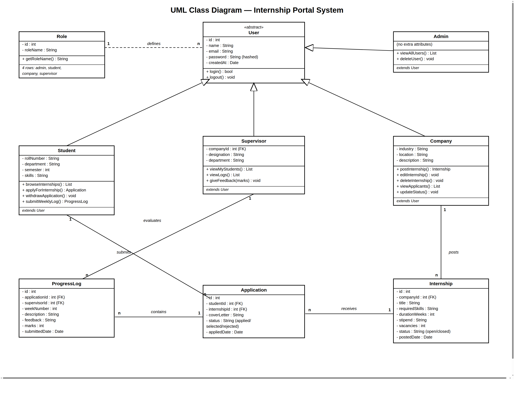
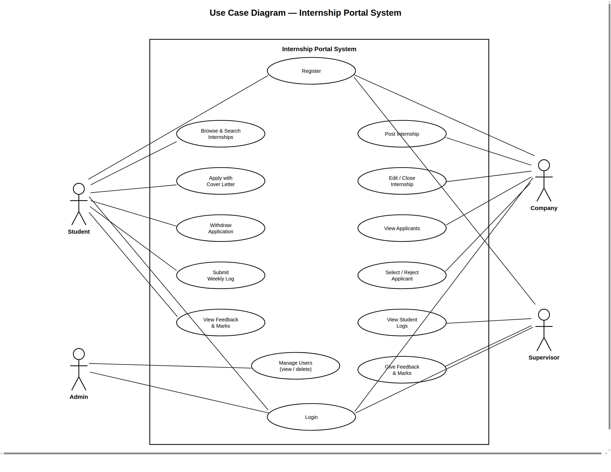
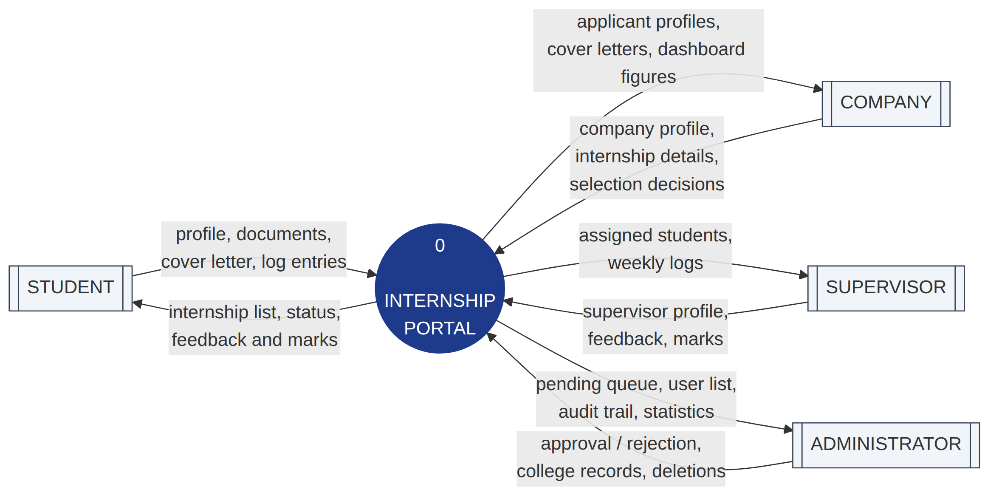
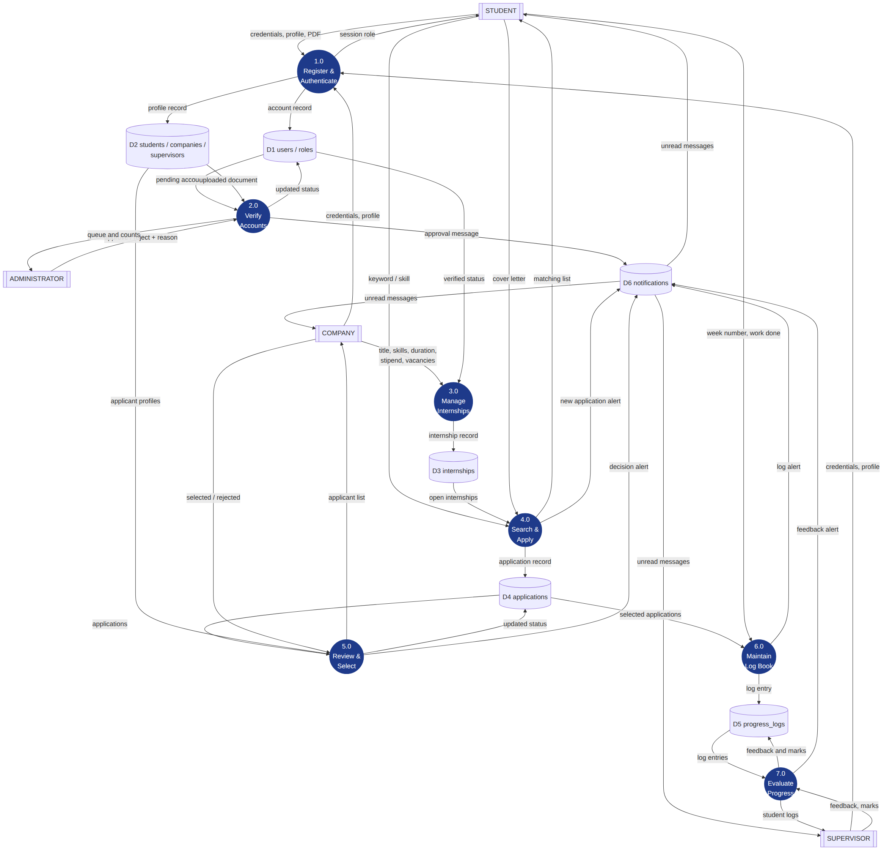

**[College Logo]**

# [Your College Name]

*(Affiliated to [University Name])*

[College Address]

A

Mid-defense Report

On

**Internship Portal**

For the partial fulfillment of requirements for the degree of Bachelor of
[Your Program] under [University Name]

**Submitted To**

Department of [Department Name]

[Your College Name]

**Under the Supervision of**

[Supervisor Name]

[Designation], Department of [Department Name]

**Submitted By:**

[Your Name] ([Your Roll Number])

Bachelor of [Your Program], [Semester] Semester

[Month, Year]

\newpage

## Student Declaration

I hereby declare that this project work entitled "Internship Portal" is an
original work carried out by me under the supervision of [Supervisor Name],
[Designation], Department of [Department Name], [Your College Name]. This
project is submitted as a partial fulfillment of the requirements for the
degree of Bachelor of [Your Program] under [University Name]. I further
declare that this project has not been submitted previously, either in whole
or in part, for any degree or diploma at any university or educational
institution. All sources of information used in this report have been
properly acknowledged through appropriate references. The work presented in
this report represents the progress completed up to the Mid-Term Defense
stage of the project.

**Submitted By**

[Your Name] ([Your Roll Number])

Bachelor of [Your Program], [Semester] Semester, [Month, Year]

\newpage

## Acknowledgement

I would like to express my sincere gratitude to my respected supervisor,
**[Supervisor Name]**, [Designation], Department of [Department Name],
[Your College Name], for the continuous guidance, valuable suggestions,
encouragement, and constructive feedback throughout the development of my
project, **Internship Portal**.

I am also thankful to the **Department of [Department Name], [Your College
Name]**, for providing me with the opportunity, resources, and academic
environment required to carry out this project successfully.

I would also like to express my heartfelt appreciation to all my teachers,
classmates, friends, and family members for their continuous support and
motivation during every phase of this project.

Finally, I would like to thank everyone who directly or indirectly
contributed to the successful completion of the mid-term phase of this
project.

\newpage

## Abstract

Every semester, students struggle to find internships, companies struggle to
collect and manage applications, and colleges have no organized record of
what students actually do during their internship period. Applications are
usually exchanged through email or personal contacts, selection results are
communicated informally, and weekly progress is rarely documented anywhere.

To address these challenges, **Internship Portal** is developed as a
web-based internship management system that connects four types of users on
one platform. Students create a profile and apply to internships with a
cover letter; companies post internships and select or reject applicants;
supervisors from the company follow the weekly log book of selected students
and give feedback with marks; and an administrator manages all users of the
system.

The system is developed using **Python Flask**, **MySQL**, **SQLAlchemy
ORM** (with PyMySQL), **HTML**, and **CSS**. Every database table is mapped
to a Python model class, and all database operations demonstrate full
**CRUD** (Create, Read, Update, Delete) functionality through the ORM, with
hashed password storage.

The primary objective of this phase of the project was to achieve complete
database connectivity and implement all CRUD operations through a role-based
web application. The complete workflow — from posting an internship to
supervisor evaluation of weekly logs — is implemented and tested.

\newpage

## Table of Contents

- Chapter 1: Introduction
- Chapter 2: Survey of Technologies
- Chapter 3: Requirements and Analysis
- Chapter 4: Design
- Chapter 5: Implementation and Testing
- Chapter 6: Results and Discussion
- Chapter 7: Conclusion
- References

\newpage

## List of Figures

- **Figure 3.6.1:** UML Class Diagram
- **Figure 3.6.2:** Use Case Diagram
- **Figure 3.6.3:** Data Flow Diagram (Level-0)
- **Figure 3.6.4:** Data Flow Diagram (Level-1)
- **Figure 4.2.1:** System Architecture
- **Figure 4.3.1:** ER Diagram / Database Schema
- **Figure 4.4.1:** Landing Page
- **Figure 4.4.2:** Login Page
- **Figure 4.4.3:** Registration Pages
- **Figure 4.4.4:** Student Dashboard and Internship List
- **Figure 4.4.5:** Company Applicants Page
- **Figure 4.4.6:** Weekly Log Book and Supervisor Feedback
- **Figure 4.4.7:** Admin User Management

## List of Tables

- **Table 3.3:** Planning and Scheduling
- **Table 3.4:** Software and Hardware Requirements
- **Table 4.3.1 – 4.3.8:** Database Table Structures
- **Table 5.5:** Test Cases

## List of Abbreviations

| Abbreviation | Full Form |
|---|---|
| CRUD | Create, Read, Update and Delete |
| CSS | Cascading Style Sheets |
| DBMS | Database Management System |
| DFD | Data Flow Diagram |
| ER | Entity Relationship |
| FK | Foreign Key |
| FR | Functional Requirement |
| HTML | HyperText Markup Language |
| HTTP | HyperText Transfer Protocol |
| NFR | Non-Functional Requirement |
| PK | Primary Key |
| SQL | Structured Query Language |
| UI | User Interface |
| UML | Unified Modeling Language |

\newpage

# CHAPTER 1: INTRODUCTION

## 1.1 Background

Internships are an essential part of every technical degree, but the process
of finding and managing them is still largely manual. Students learn about
openings through notice boards or personal contacts, apply by email, and
receive results informally. Companies have no single place to collect and
compare applicants, and once an internship starts, the student's weekly work
is almost never recorded or evaluated systematically.

Internship Portal is a web-based system designed to organize this entire
workflow on one platform. Students browse and apply to internships online,
companies review applicants and make selections, company supervisors follow
each selected student's weekly log book and evaluate it with feedback and
marks, and an administrator oversees all users of the system.

## 1.2 Objectives

- To build a web application with complete MySQL database connectivity.
- To implement all CRUD operations (Create, Read, Update, Delete) using the SQLAlchemy ORM.
- To provide secure, role-based access for four types of users (admin, student, company, supervisor).
- To manage the complete internship workflow: posting, application with cover letter, selection, and withdrawal.
- To maintain a weekly progress log of every selected student with supervisor feedback and marks.

## 1.3 Purpose, Scope and Applicability

### 1.3.1 Purpose

The purpose of Internship Portal is to provide a single organized platform
where the complete internship life cycle — from posting an opening to
evaluating a student's weekly progress — is recorded and managed.

### 1.3.2 Scope

The system includes role-based registration and login, internship posting
and management by companies, student applications with cover letters,
applicant selection, weekly progress logs with supervisor feedback and
marks, role-specific dashboards, and user administration. It is designed
for colleges and companies that take student interns.

### 1.3.3 Applicability

Internship Portal can be used by any college to connect its students with
partner companies, and by companies to manage their internship programs and
track intern progress through their own supervisors.

## 1.4 Achievements

The following work has been completed during the mid-term phase:

- Database design completed (8 tables with primary keys, foreign keys and cascade rules).
- Database connectivity from Python implemented using PyMySQL.
- All four CRUD operations implemented through the SQLAlchemy ORM across the system.
- Role-based registration, login and session management implemented for all four roles.
- Complete workflow implemented: post internship → apply → select → weekly logs → feedback and marks.
- Public landing page and role-specific dashboards implemented.
- Manual testing of all user journeys completed.

## 1.5 Organization of Report

This report is divided into seven chapters. Chapter One introduces the
project. Chapter Two discusses existing systems and the chosen technologies.
Chapter Three explains the system requirements and analysis. Chapter Four
presents the system design. Chapter Five describes implementation and
testing. Chapter Six discusses the results, while Chapter Seven concludes
the project with limitations and future scope.

\newpage

# CHAPTER 2: SURVEY OF TECHNOLOGIES

## 2.1 Review of Existing System

Several existing platforms such as **LinkedIn** and **Internshala** were
studied during the development of Internship Portal. These platforms
provide facilities for finding internships and jobs at a large scale.
However, they are designed as open public marketplaces: a college has no
control over which companies participate, no record of its own students'
applications, and — most importantly — no mechanism to track what a student
actually does every week during the internship.

In most colleges, the internship process is still handled manually. Openings
are shared through notice boards or messaging groups, students apply by
email, and selection results are communicated informally. Weekly progress
reports, if they exist at all, are paper-based and rarely evaluated.

To overcome these limitations, Internship Portal provides a closed,
college-scale platform where companies post openings, students apply with a
cover letter, and — after selection — every week of the internship is
logged by the student and evaluated by a company supervisor with feedback
and marks.

## 2.2 Technologies Used

- **Python Flask** — a lightweight web framework, chosen over heavier frameworks because it keeps the routing, templates and logic simple and visible.
- **MySQL** — a widely used relational DBMS that stores all system data in 8 related tables.
- **SQLAlchemy ORM (Flask-SQLAlchemy)** — maps every database table to a Python model class, so rows are handled as objects; taught in class and used for all CRUD operations.
- **PyMySQL** — the driver through which SQLAlchemy connects to MySQL.
- **HTML + Jinja Templates** — page structure, with one shared base layout.
- **CSS** — plain custom stylesheet (no framework), with colors defined once as variables.
- **Git / GitHub** — version control.

\newpage

# CHAPTER 3: REQUIREMENTS AND ANALYSIS

## 3.1 Problem Definition

There is no single system where students, companies and supervisors can
work together during an internship. This causes several problems:

- Students do not know which companies are offering internships.
- Companies receive applications through many informal channels and lose track of them.
- There is no record of what work a student actually performs each week.
- Supervisor feedback is informal and never stored anywhere.
- The college administration has no overview of users and activities.

## 3.2 Requirements Specification

The requirements of the Internship Portal system are classified into
Functional Requirements and Non-Functional Requirements.

### Functional Requirements

- **FR-1:** The system shall allow students, companies and supervisors to register with role-specific details.
- **FR-2:** The system shall allow registered users to log in with email and password, and log out.
- **FR-3:** The system shall reject registration with an already-used email address.
- **FR-4:** The system shall identify each user's role at login and show only pages and data belonging to that role.
- **FR-5:** A company shall be able to post an internship with title, description, required skills, duration, stipend and vacancies.
- **FR-6:** A company shall be able to edit, close or delete only its own internships.
- **FR-7:** A student shall be able to browse and search open internships and apply with a cover letter.
- **FR-8:** The system shall prevent a student from applying twice to the same internship.
- **FR-9:** A student shall be able to view the status of their applications and withdraw an application.
- **FR-10:** A company shall be able to view applicants with their details and mark each application as selected or rejected.
- **FR-11:** A selected student shall be able to submit weekly progress logs (week number, work done).
- **FR-12:** A supervisor shall be able to view the selected students of their own company, read their weekly logs, and give feedback with marks.
- **FR-13:** A student shall be able to see the supervisor's feedback and marks on their logs.
- **FR-14:** The admin shall be able to view all users and delete a user, with all related data removed automatically (cascade delete).
- **FR-15:** The system shall show each role a dashboard with statistics relevant to that role, and a public landing page with overall counts.

### Non-Functional Requirements

- **NFR-1 (Security):** Passwords shall never be stored in plain text; they are hashed using Werkzeug's password hashing functions.
- **NFR-2 (Security):** All database access goes through the SQLAlchemy ORM, which sends every value as a bound parameter, preventing SQL injection.
- **NFR-3 (Access control):** Every page shall verify the session role, and users shall act only on their own data.
- **NFR-4 (Data integrity):** The database shall enforce integrity through primary keys, foreign keys, a unique email, and a unique (student, internship) pair.
- **NFR-5 (Usability):** The interface shall be simple and usable without training, with clear feedback messages after every action.
- **NFR-6 (Maintainability):** The code shall be organized one file per concern so changes are localized.
- **NFR-7 (Portability):** The system shall run on any machine with Python 3 and MySQL, with only two external dependencies.
- **NFR-8 (Performance):** Pages shall load with a small number of SQL queries using JOINs, giving fast response at college scale.

## 3.3 Planning and Scheduling

**Table 3.3: Planning and Scheduling**

| Phase | Duration | Work |
|---|---|---|
| Requirement analysis | Week 1 | Study problem, define roles and features |
| Database design | Week 2 | ER model, 8 tables, keys and relations |
| Authentication module | Week 3 | Registration (3 types), login, sessions |
| Internship & application modules | Week 4–5 | Post/edit/delete, apply, select/reject |
| Progress log module | Week 6 | Weekly logs, feedback and marks |
| Testing & documentation | Week 7 | Manual testing, diagrams, this report |
| Remaining work (after mid-term) | Week 8+ | File uploads, search filters, reports, deployment |

## 3.4 Software and Hardware Requirements

**Table 3.4: Software and Hardware Requirements**

| Category | Requirement |
|---|---|
| Operating System | Windows / Linux / macOS |
| Language | Python 3 |
| Framework | Flask |
| Database | MySQL (via PyMySQL) |
| Frontend | HTML, CSS, Jinja templates |
| Tools | VS Code, Git, MySQL client |
| Hardware | Any computer with 4 GB RAM and MySQL installed |

## 3.5 Preliminary Product Description

Internship Portal is a role-based web application. A visitor sees a landing
page with live statistics and can register as a student, company or
supervisor. After login, each role gets its own dashboard and pages:
students browse and apply to internships and maintain a weekly log book
after selection; companies post internships and manage applicants;
supervisors evaluate the weekly logs of selected students at their company;
and the admin manages all users.

## 3.6 Conceptual Models

### 3.6.1 UML Class Diagram



### 3.6.2 Use Case Diagram



### 3.6.3 Data Flow Diagram





\newpage

# CHAPTER 4: DESIGN

## 4.1 Introduction

This chapter presents the architecture of the system, the database design
with all table structures, and the interface design.

## 4.2 System Design

The system uses a simple three-layer architecture:

```
Browser (HTML/CSS)  <-->  Flask (Python, routes/)  <-->  MySQL (database)
```

1. The user opens a page or submits a form in the browser.
2. Flask matches the URL in `app.py` and runs the corresponding function from the `routes/` folder.
3. The function executes SQL on MySQL through PyMySQL and renders an HTML template with the result.

The project is organized as follows:

```
Internship_Portal/
├── app.py              main file: connects every URL to its function
x-noop
├── routes/             page functions, one file per part of the site
│   ├── auth.py         register (3 types), login, logout
│   ├── main.py         landing page, dashboard, internship list
│   ├── student.py      apply, my applications, weekly logs
│   ├── company.py      post/edit/delete internships, applicants
│   ├── supervisor.py   my students, view logs, give feedback
│   └── admin.py        manage users
├── database.sql        creates the database, 8 tables and admin account
├── static/style.css    all styling (plain CSS)
└── templates/          HTML pages (all extend base.html)
```

## 4.3 Database Design

**[ Insert Figure 4.3.1: your ER diagram here ]**

The database `internship_db` has 8 tables. All foreign keys use
`ON DELETE CASCADE`, so deleting a user automatically removes all of that
user's data.

**Table 4.3.1: roles** — the four types of users

| Column | Type | Key |
|---|---|---|
| id | INT, AUTO_INCREMENT | PK |
| role_name | VARCHAR(20), UNIQUE | admin / student / company / supervisor |

**Table 4.3.2: users** — central login table

| Column | Type | Key |
|---|---|---|
| id | INT, AUTO_INCREMENT | PK |
| role_id | INT | FK → roles(id) |
| name | VARCHAR(100) | |
| email | VARCHAR(100), UNIQUE | |
| password | VARCHAR(255) | stored as hash |
| created_at | TIMESTAMP | |

**Table 4.3.3: students** — extra details of a student user

| Column | Type | Key |
|---|---|---|
| id | INT, AUTO_INCREMENT | PK |
| user_id | INT, UNIQUE | FK → users(id) |
| roll_number | VARCHAR(50) | |
| department | VARCHAR(100) | |
| semester | INT | |
| skills | VARCHAR(255) | |

**Table 4.3.4: companies** — extra details of a company user

| Column | Type | Key |
|---|---|---|
| id | INT, AUTO_INCREMENT | PK |
| user_id | INT, UNIQUE | FK → users(id) |
| industry | VARCHAR(100) | |
| location | VARCHAR(100) | |
| description | TEXT | |

**Table 4.3.5: supervisors** — company staff who guide students

| Column | Type | Key |
|---|---|---|
| id | INT, AUTO_INCREMENT | PK |
| user_id | INT, UNIQUE | FK → users(id) |
| company_id | INT | FK → companies(id) |
| designation | VARCHAR(100) | |
| department | VARCHAR(100) | |

**Table 4.3.6: internships** — posted by companies

| Column | Type | Key |
|---|---|---|
| id | INT, AUTO_INCREMENT | PK |
| company_id | INT | FK → companies(id) |
| title | VARCHAR(200) | |
| description | TEXT | |
| required_skills | VARCHAR(255) | |
| duration_weeks | INT | |
| stipend | VARCHAR(50) | |
| vacancies | INT | |
| status | VARCHAR(20) | open / closed |
| posted_date | TIMESTAMP | |

**Table 4.3.7: applications** — a student applies to an internship

| Column | Type | Key |
|---|---|---|
| id | INT, AUTO_INCREMENT | PK |
| student_id | INT | FK → students(id) |
| internship_id | INT | FK → internships(id) |
| cover_letter | TEXT | |
| status | VARCHAR(20) | applied / selected / rejected |
| applied_date | TIMESTAMP | |

A UNIQUE constraint on (student_id, internship_id) prevents duplicate
applications.

**Table 4.3.8: progress_logs** — weekly work reports

| Column | Type | Key |
|---|---|---|
| id | INT, AUTO_INCREMENT | PK |
| application_id | INT | FK → applications(id) |
| supervisor_id | INT | FK → supervisors(id) |
| week_number | INT | |
| description | TEXT | work done by the student |
| feedback | TEXT | written by the supervisor |
| marks | INT | out of 10 |
| submitted_date | TIMESTAMP | |

## 4.4 Interface Design

The interface uses one shared layout (`base.html`) with a navigation bar
that changes according to the logged-in role, and a plain CSS stylesheet.

**[ Insert screenshots here as Figures 4.4.1 – 4.4.7: landing page, login
page, registration pages, student dashboard and internship list, company
applicants page, weekly log book with supervisor feedback, admin user
management ]**

\newpage

# CHAPTER 5: IMPLEMENTATION AND TESTING

## 5.1 Implementation Approach

The application is implemented in Python Flask with the SQLAlchemy ORM over
MySQL. `models.py` defines every table as a model class with its
relationships. `app.py` acts as a routing table: every URL of the site is
connected to a function in the `routes/` folder using `app.add_url_rule()`.
Each function queries or changes data through the ORM (`Model.query`,
`db.session.add/delete`, `db.session.commit()`) and renders an HTML
template.

Login stores the user's id, name and role in the Flask session; every page
first checks `session['role']` before showing anything.

## 5.2 Coding Details and Code Efficiency

A model class in `models.py` maps a table to Python (example):

```python
class Student(db.Model):
    __tablename__ = 'students'
    id = db.Column(db.Integer, primary_key=True)
    user_id = db.Column(db.Integer, db.ForeignKey('users.id'), unique=True)
    roll_number = db.Column(db.String(50))
    semester = db.Column(db.Integer)
    applications = db.relationship('Application', backref='student',
                                   cascade='all, delete-orphan')
```

CREATE — registration builds the user and profile objects together through
the relationship, and one commit inserts both rows:

```python
user = User(role_id=role.id, name=name, email=email)
user.set_password(password)
student = Student(user=user, roll_number=roll_number, semester=semester)
db.session.add(student)
db.session.commit()
```

READ — queries return objects, and related data is reached through
relationships instead of manual joins:

```python
apps = Application.query.filter_by(student_id=me.id).all()
# in the template: a.internship.title, a.internship.company.user.name
```

UPDATE and DELETE — change an attribute or delete an object, then commit:

```python
application.status = 'selected'
db.session.commit()

db.session.delete(internship)   # its applications and logs cascade
db.session.commit()
```

Code efficiency measures: the ORM binds every value as a parameter
(preventing SQL injection); relationships with `cascade` remove related
rows automatically; shared helpers (`current_student()`,
`current_company()`, `current_supervisor()`) avoid repeated code; and
model classes mirror the UML class diagram one-to-one.

## 5.3 Testing Approach

The system was tested manually by walking through every user journey for
all four roles — registering, logging in, and performing every action each
role is allowed (and checking forbidden actions are blocked). The database
was inspected after each step to confirm the SQL operations worked
correctly.

## 5.4 Modifications and Improvements

During development the following improvements were made over the first
version:

- Code was reorganized from one large file into a `routes/` folder (one file per role) with `app.py` as a clear URL table.
- Dashboards were changed to show each role only its own relevant statistics instead of system-wide numbers.
- A public landing page with live database counts was added.
- The database was extended from an initial 3-table prototype to the full 8-table design matching the ER model.
- The CSS was refined with variables so the whole color scheme can be changed in one place.

## 5.5 Test Cases

**Table 5.5: Test Cases**

| # | Test Case | Steps | Expected Result | Result |
|---|---|---|---|---|
| 1 | Student registration | Fill the student form and submit | Rows created in users and students, redirect to login | Pass |
| 2 | Duplicate email | Register again with the same email | "Email is already registered" message | Pass |
| 3 | Wrong password | Login with wrong password | "Invalid email or password" message | Pass |
| 4 | Post internship | Login as company, fill the post form | Internship appears in the list | Pass |
| 5 | Apply | Login as student, apply with cover letter | Application saved with status "applied" | Pass |
| 6 | Apply twice | Apply again to the same internship | "You already applied" message | Pass |
| 7 | Select applicant | Company changes status to selected | Status badge changes to "selected" | Pass |
| 8 | Weekly log | Selected student submits week 1 log | Log appears in the log book | Pass |
| 9 | Feedback | Supervisor writes feedback and marks | Feedback and marks visible to the student | Pass |
| 10 | Delete user | Admin deletes a company | Company, its internships and applications removed (cascade) | Pass |
| 11 | Access control | Student opens a company-only page | Redirected away | Pass |

\newpage

# CHAPTER 6: RESULTS AND DISCUSSION

## 6.1 Test Reports

All 11 test cases in Table 5.5 pass. The complete workflow was verified end
to end: a company posted an internship, a student applied with a cover
letter, the company selected the student, the student submitted weekly
logs, the supervisor gave feedback with marks that became visible to the
student, and the admin viewed and deleted users with cascade removal of
their data. Role-based access control was verified by attempting to open
pages of other roles, which correctly redirect away.

## 6.2 User Documentation

- **Student:** Register with your details → login → browse internships → apply with a cover letter → after selection, open My Applications → Weekly Logs to submit each week's work and read the supervisor's feedback and marks.
- **Company:** Register → login → Post Internship → view applicants of each post → mark them selected or rejected → edit or close the internship when filled.
- **Supervisor:** Register under your company → login → My Students shows selected interns → open a student's log book → write feedback and marks for each week.
- **Admin:** Login (default account: admin@portal.com) → Users page lists everyone → delete a user if needed.

\newpage

# CHAPTER 7: CONCLUSION

## 7.1 Conclusion

This phase of the project successfully achieved its main objective: a
working web application with full database connectivity and all four CRUD
operations implemented through the SQLAlchemy ORM, where every table is a
Python model class. The complete internship workflow — from a company
posting an internship to a supervisor marking a student's weekly log —
works end to end with role-based access control and hashed passwords.

## 7.2 Limitations

- No file uploads yet (resume, verification documents, log attachments).
- Search supports only internship titles; there are no advanced filters.
- No email notifications when an applicant is selected.
- The system runs on a local development server, not a live deployment.

## 7.3 Future Scope

- Resume and document upload for students.
- Search and filter by skills, duration and stipend.
- Email notifications for selection results and new feedback.
- Reports for the admin (internships per company, application statistics).
- Deployment on a live server with a production database.

\newpage

## References

1. Flask Documentation — https://flask.palletsprojects.com/
2. MySQL Documentation — https://dev.mysql.com/doc/
3. PyMySQL Documentation — https://pymysql.readthedocs.io/
4. Jinja Template Documentation — https://jinja.palletsprojects.com/
5. Werkzeug Documentation — https://werkzeug.palletsprojects.com/
